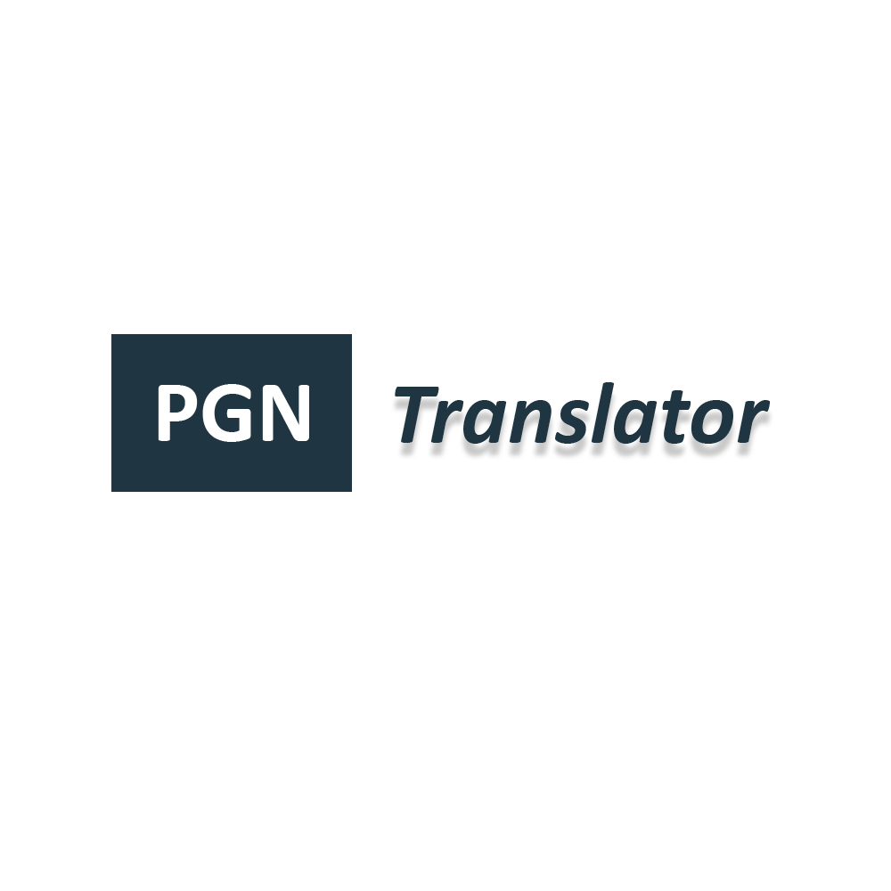

<!-- PROJECT LOGO -->
 

  

  

    An easy way to translate Portable Game Notation (PGN)!
     
    <a href="https://github.com/othneildrew/Best-README-Template"><strong>Visit the PGN Translator »</strong></a>
     
     
  

<!-- TABLE OF CONTENTS -->

  
Table of Contents

  <ol>
    <li>
      <a href="#about-the-project">About The Project</a>
      <ul>
        <li><a href="#built-with">Built With</a></li>
      </ul>
    </li>
    <li>
      <a href="#getting-started">Getting Started</a>
      <ul>
        <li><a href="#prerequisites">Prerequisites</a></li>
        <li><a href="#installation">Installation</a></li>
      </ul>
    </li>
    <li><a href="#usage">Usage</a></li>
    <li><a href="#license">License</a></li>
    <li><a href="#contact">Contact</a></li>
  </ol>

<!-- ABOUT THE PROJECT -->
## About The Project

Chess is a universal game loved by people from various cultures and backgrounds. The PGN Translator is a web application that bridges the language barrier in the chess community. This project is designed to provide chess players worldwide with a practical and more precise solution to translate chess game notations, known as PGN (Portable Game Notation).

[![PGN Trnaslator][product-screenshot]](https://www.pgntranslator.com/)

(<a href="#readme-top">back to top</a>)

### Built With

* [![Bootstrap][Bootstrap.com]][Bootstrap-url]
* [![Bootstrap][Bootstrap.com]][Bootstrap-url]

<!-- GETTING STARTED -->
## Getting Started

<!-- USAGE EXAMPLES -->
## Usage

<!-- LICENSE -->
## License

Distributed under the MIT License.

(<a href="#readme-top">back to top</a>)

<!-- MARKDOWN LINKS & IMAGES -->
[product-screenshot]: readme_images/Project-screenshot.png
[Bootstrap.com]: https://img.shields.io/badge/Bootstrap-563D7C?style=for-the-badge&logo=bootstrap&logoColor=white
[Bootstrap-url]: https://getbootstrap.com
